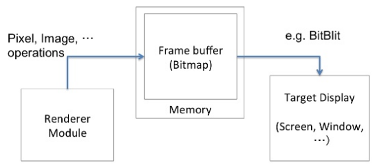
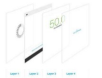
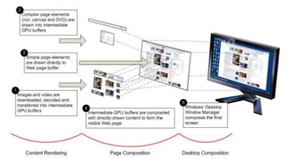
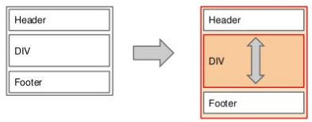
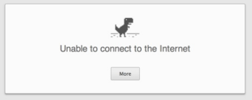

# GDG WebTech Workshop: 측정하는 놈, 로딩하는 놈, 그리는 놈

2016-08-27 WebTech Workshop 내용입니다.

## Slides

* http://www.slideshare.net/cwdoh/gdg-webtech-1
* http://www.slideshare.net/cwdoh/instant-and-offline-apps-with-service-worker
* http://www.slideshare.net/cwdoh/service-worker-101
* http://www.slideshare.net/cwdoh/overview-how-to-measure-your-web-app

---

## 프론트엔드 개발자를 위한 크롬 렌더링 성능 인자 이해하기

웹 브라우저(특히 크롬)에서 렌더링의 성능을 결정하는데 중요한 것이 무엇인지 알아보고 그 것의 개념과
개선하기 위한 방법을 알아본다.

### 하드웨어 가속

하드웨어 가속을 사용하는 것은 같은 기능을 하드웨어(GPU)의 도움을 받는 것을 의미한다.

**소프트웨어 렌더링 실행 구조**



계산, 메모리에 올리는 일, 출력하는 일을 모두 도맡아 하게 된다.

*소프트웨어 렌더링 성능 = 주요 기능의 수행시간 + 그래픽스 출력 시간*

따라서 주요 기능의 수행은 CPU에 맡기고 그래픽 관련 처리를 GPU에 맡기는 것이 포인트.

### CPU와 GPU 사이에 존재하는 이슈

#### 1. 서로 다른 메모리 공간

CPU가 어떤 것을 그려야 하는지 GPU에 넘겨 주는데 서로 다른 메모리 공간을 사용하기 때문에
BUS를 통해 CPU -> GPU 전달한다. 문제는 이 BUS를 통한 커뮤니케이션이 느리다는 것.

#### 2. 메모리 한계

처리할 모든 데이터는 메모리에 있지만, 이 메모리는 한계가 있다는 것.

#### 3. 데이터가 자주 변경된다.

CPU의 데이터 변경 시 GPU 메모리도 변경되어야 반영할 수 있다.

### GPU

GPU는 공간 좌표(Vertex)를 모아 도형(Polygon)을 만들고 여기에 이미지(Texture)를 씌워 그린다(Mapping).

#### GPU가 잘하는 것

GPU는 수신된 데이터로 무언가를 그리는데 적합하다.

1. 텍스쳐를 가지고 이미지를 빠르게 출력 가능
2. 이미 가진 텍스쳐는 다시 받지 않고 재활용
3. 변환(Transform, 회전, 확대, 축소, 기울임) 반투명 처리 등
4. 위 기능들을 동시에 처리하는 것도 매우 최적화

#### GPU의 약점

CPU -[BUS]-> GPU 데이터 전송 속도

##### 하지만 더 큰 이슈는 **CPU의 처리 시간**

GPU의 데이터는 CPU에서 생성 후 전송한다.

즉, CPU에서 데이터 가공 시간 + CPU -> GPU 데이터 전달 시간이 문제이다.

### 렌더링 성능의 주요 인자

1. 변환(회전, 확대, 축소, 기울임)과 반투명 처리 등은 GPU가 처리할 수 있도록 한다.
2. CPU가 새로운 데이터를 만드는 작업은 최소화한다.
3. CPU -> GPU 데이터 전송을 최소화 한다.

## 크롬의 하드웨어 가속 렌더링 메커니즘

### 웹페이지의 렌더링

```
[DOM Tree] --------
                  | --- [Render tree] --- [Paint!]
[Styles struct] ---
```

위에 서술한 부분들은 모두 Render tree 부분이다.

### 레이어 모델

레이어(Layer)는 웹페이지를 렌더링하기 위해 필요한 이미지 단위 요소.

CPU가 이 레이어를 생성한다. 즉, 레이어에서 생성되는 이미지는 CPU 시간 소모.



웹 페이지는 레이어들의 겹침으로 표현된다.

### 컴포지트 (Composite)

각 요소들을 텍스쳐 이미지를 합치는 GPU의 작업.



### 렌더링 이슈

#### Reflow

DOM 노드가 가지는 레이아웃 정보가 변경되면 재배치를 위한 계산이 필요하다.



레이아웃의 변경이 트리를 따라 전파되고, 많은 경우 레이어 이미지의 갱신이 필요하다.

#### Repaint

레이아웃 내 컨텐츠 변경 시 텍스쳐를 새로 생성 필요.

#### Reflow / Repaint 발생 요인

* DOM 노드의 동적인 추가 / 삭제 / 업데이트
* DOM 노드의 감춤 / 표시
   * display: none / visibility: hidden
* DOM 노드의 이동, 애니메이션
* 스타일시트의 추가 혹은 스타일 속성의 변경
   * 미디어 쿼리
* 브라우저 사이즈 변경
* 폰트 변경
* 스크롤

### 크롬 개발자도구

#### Timeline

https://developers.google.com/web/tools/chrome-devtools/profile/evaluate-performance/timeline-tool?hl=ko#timeline-overview

어떤 노드가 렌더링하는데 오래 걸리는지 알 수 있다.

#### Elements > Rendering

##### Paint Flashing

체크하면 repaint 되는 부분을 강조 표시해 준다.

애니메이션이 일어나는 부분들은 쉽게 볼 수 있다.

##### Layer Borders

체크하면 레이아웃의 레이어 구조를 볼 수 있다.

오렌지색 선이 레이어이며, 이는 GPU에 의해 렌더링 되는 것을 의미한다.

#### User Timing

크롬 개발자 도구는 GUI를 지원하므로 디테일한 시간으로 캐치하기 힘들다.

이를 위해서 코드 내에서 캐치할 수 있는 API가 존재한다.

*실제로 사용해보지 않았음.*

[window.performance.mark](https://developer.mozilla.org/en-US/docs/Web/API/Performance/mark)

*이하는 크롬에서만 동작할 것*

Reference: https://developers.google.com/web/tools/chrome-devtools/debug/console/console-reference

console.timeline

### 크롬에서의 전반적인 렌더링 흐름

1. DOM으로부터 노드들을 레이어 단위로 분리
2. 레이아웃을 계산하고 각 레이어가 그려져야 할 영역의 크기, 위치 등을 계산
   * 크기, 위치 정보 등을 계산하기 위한 **CPU 계산 오버헤드** 발생
3. 레이어들 각각은 렌더링을 위해 비트맵 출력
   * **CPU에서 레이어 이미지를 생성하는 오버헤드** 발생
4. 생성된 비트맵을 GPU에 업로드
   * **GPU의 비디오 메모리로 전송하는 오버헤드** 발생
5. 계산된 레이아웃으로 레이어 텍스쳐 이미지들을 최종 스크린 이미지로 합성

## 렌더링 최적화 방법

### 가장 간단한 방법 : 최소한으로 레이어 분리

레이어는 GPU가 그리기 때문에 빠른 성능을 요구하는 부분을 레이어로 분리하여 GPU가 그리게 하는 것.

하지만 모든 렌더링을 GPU에 전가하는 것 또한 병목현상을 유발하므로 **최소한**으로 분리하는 것이 좋다.

**크롬에서 DOM 노드가 레이어로 분리되는 조건**

1. 3D 혹은 Perspective를 표현하는 CSS transform 속성을 가진 경우
2. 하드웨어 가속 디코딩을 사용하는 ```<video>``` Element
3. 3D Context 또는 가속 2D Context를 가지는 ```<canvas>``` Element
4. (플래시 등) 플러그인 영역
5. opacity 속성, transform 애니메이션을 사용하는 경우
6. 가속 가능한 CSS 필터를 가진 경우
7. Compositing Layer를 하위 노드로 가지는 경우
8. 낮은 z-index를 가진 형제 노드가 Compositing Layer를 가진 경우

#### translateZ(0)

Z축 값으로 0을 주는 무의미한 코드이나 레이어 분리 조건에 들어간다.

필요한 경우가 아니라면 사용하지 않는 것이 좋다.

### 강제적인 레이어 분리가 만능이 아닌 이유

#### 레이어 분리는 텍스쳐 이미지의 분리를 의미한다.

이는 추가적인 메모리를 소모함을 의미하며, 메모리는 유한하다.

메모리 공간이 부족해지면 기존 데이터 릴리즈 후 새로운 메모리를 업로드 한다.

이 경우가 반복되면 레이어 분리를 통한 성능 이점이 오버헤드로 상쇄된다.

### CSS: will-change

**will-change: 속성명;**

이 속성이 변경 될 수 있음을 브라우저에 힌트를 준다. 브라우저는 실제 요소가 변화되기 전에 적절하게 최적화 할 수 있게 된다.[^설명][^팁]

---

## Instant and offline apps

### Instant Loading

로딩을 개선하기 위해서 목표는 다음과 같다:

* 큰 이미지 사용 금지
* 필요한 것만 다운로드
* 가급적이면 바뀐 부분만 다운로드

그러면 위 목표들을 위해서 무엇을 해야 할까?

#### 압축

* 스크립트, 스타일시트 파일 압축하기
* webp 압축 이미지 포맷 사용 (크롬과 특정 브라우저만 지원)

#### 작은 이미지 사용

* 다양한 사이즈와 포맷을 지원한다.
* img 태그의 sizes 속성을 이용하여 반응형 지원 가능

#### Round Trips 줄이기

* Redirect은 Round Trip을 야기한다.
* link 태그 rel 속성에 힌트 정의하기
    * rel="dns-prefetch"
    * rel="preconnect"
    * rel="preload"
    * rel="prefetch"

#### Be interactive

* script 태그에 defer, async 사용하여 병렬 로드

#### iFrame

iFrame은 사용하지 않음에도 메인이 로드될 때 함께 로드된다. 메인 시스템이 로드 되는 것을 방해하는 것이다.

스크립트를 통해 메인 시스템 로드 후 로드될 수 있도록 한다.

**스크립트 예**
```html
<iframe data-src="https://example.com"></firame>
<iframe data-src="https://another.example.com"></firame>
<script>
    document.addEventListener('load', () => {
        Array.from(document.querySelectorAll('iframe'))
            .forEach(iframe => iframe.src = iframe.dataset.src);
    });
</script>
```

#### HTTP/2

기존의 HTTP 1.1은 분할된 이미지가 있으면 요청을 분할하여 여러번 나눠서 요청한다.

이미지를 255조각 내었다면 요청을 255번 하는 것이다.

반면에 HTTP/2는 한 번에 모두 요청한다.

HTTP/2를 사용하려면 https를 사용해야 한다.

---

## Service Worker

오프라인에 대응할 수 있고, 싱글 스레드인 자바스크립트에서 분리된 스레드로 앱의 백그라운드에서 동작하는
서비스 워커에 대해 알아본다.

### 오프라인 로딩

네트워크가 애매한 경우 (Lie-fi 라고 한다.) 앱은 느린 네트워크를 통해 데이터를 받아 오려고 시도하고
사용자는 언제 로드 될지 알 수 없는 컨텐츠를 하염없이 기다려야 한다.

서비스 워커의 캐싱을 사용하면 요청 중 오프라인이 되거나 서버로부터 컨텐츠를 받기 전까지 사용자에게
저장된 캐싱 데이터를 보여줄 수 있다.

### Web worker

서비스 워커는 특정한 워커 중 하나이다.

그리고 웹 워커는 메인 페이지와 병렬 **스크립트를 실행하는 백그라운드 워커를 생성**하는 API다.

**메시지 전송 기반의 Thread와 유사한 동작**을 가능하게 한다.

**즉, 병렬 스크립트 실행을 위한 API.**

특징으로는

* DOM 직접 접근, 조작 불가
* 자체 글로벌 스코프 (window가 아님)
* window가 아니므로 일부 속성과 API만 사용 가능

### Service Worker

**지속적인 백그라운드 처리를 하는 워커**로 **이벤트 드리븐 모델**이다.

지속적이라는 의미는 **페이지가 로딩되지 않았을 때도 동작**한다.

따라서 페이지가 실행되지 않더라도 브라우저가 관리한다.

#### 기능: 오프라인 캐쉬



크롬 브라우저는 오프라인일 때 간단한 게임을 할 수 있는 서비스 페이지를 제공한다.

오프라인 캐쉬는 이용자가 네트워크 요청시 **서버로 바로 가는 것이 아니라**
개발자가 어떻게 동작할 것인지 제어할 수 있는 기능이다.

#### 기능: 백그라운드 동기화

위에서 **페이지가 로딩되지 않았을 떄도 동작**한다고 하였다.

이를 이용하여 사용자가 데이터 입력 중 인터넷이 끊어지더라도 데이터를 저장해 두었다가
나중에 네트워크 연결이 되면 **앱을 다시 실행하지 않더라도** 데이터를 서버에 보낼 수
기능을 구현할 수 있다.

#### 규칙, 장점

Https를 필숵으로 사용해야 한다.

데이터의 신뢰성이 보장되지 않으면 사용자의 의도와는 다른 데이터를 서버에 전송할 수 있기 때문이다.

Polyfill이 없어서 시스템에서 지원하지 않으면 그냥 동작하지 않는다.

---

[^1]: 설명: https://developer.mozilla.org/ko/docs/Web/CSS/will-change
[^2]: 팁: https://dev.opera.com/articles/ko/css-will-change-property/
